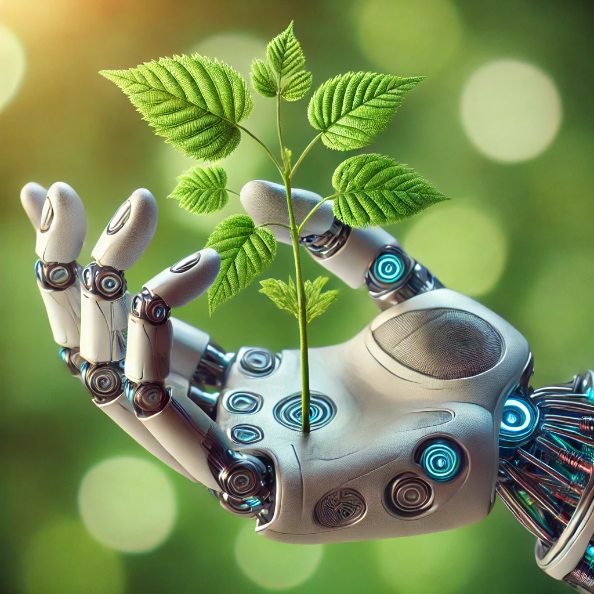

# SustainabilityGPT

**Team Name:** The Gersons
- Brian Becker - Website
- Benson Jiang - Website
- Isaac Saland - Website
- Bryan Cho - Chrome Extension 
- Seth Lupo - Chrome Extension
- Yuvit Batra - Chrome Extension

**Description:**

Did you know that some scientists predict AI is going to cause CO2 emissions to increase to double over the next 10 years?

Large language models are a powerful technology; however they are extremely power intensive. This resource intensive technology drains electricity, guzzles water, and spews CO2. As a group, we aimed to

A. Spread awareness about one's own environmental impact

B. Reduce one's own environmental impact

### Awareness

We've created multiple TOOLS to quantify the environmental impact for generating text. We've created 2 primary tools:

1. **Live Resource Consumption Chrome Extension** We've created a chrome extensions that predicts/tracks the live resource consumption. It displays live estimates estimate the energy, water, and CO2 used in a given chat. It updates as new text is being produced. Additionally, our extension supports the predicting the resource consumption of generating a certain text from multiple file formats (.txt, .pdf, .docx). This allows the individual to QUANTIFY their AI's usage on the environment. 

2. **Long-Term Resource Consumption Analytics** In a few short steps we've created a website that shows your long term resource consumption. TBC

### Impact Reduction

While this is a complex issue, there is one relatively way to reduce the footprint of each query: ask ChatGPT to produce less text. In our extension, we created a "Energy Saver" setting that automatically prompt-engineers each query to reduce output size. 

## Acknowledgements  
- ChatGPT itself was used about everywhere in this codebase.
- We used GPT-Tokenizer to count the tokens in text. This was instrumental to our model.

<!-- ## ✨ Optional Reflection  

### What We Learned  
[Share key takeaways from this hackathon experience. What did you learn as a team?]  

### Motivation & Future Plans  
[Why did you choose this project? Are there features you’d love to implement in the future?]  

### Challenges & How We Overcame Them  
[Describe a technical challenge or tricky bug your team faced and how you solved it.]  

### Fun Hackathon Moments  
[Share a fun or interesting moment! Did you meet someone new? Attend an inspiring workshop?]  -->